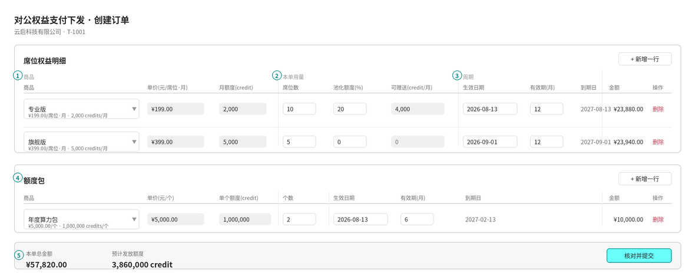
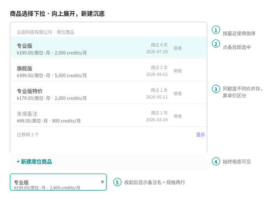
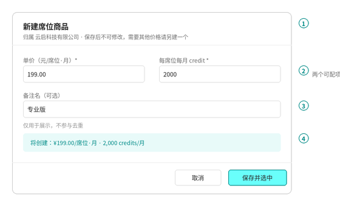

# PRD | 席位与额度包商品化

本文是《PRD-对公支付权益下单》的增补，只描述「创建订单」页里席位行与额度包行的填写方式改造。未提及的部分沿用原 PRD。

---

# 1 背景与目标

## 1.1 背景

当前创建订单页的席位行与额度包行，名称、单价、额度全部自由填写。同一个客户续单、加购时要把同一套定价重复手敲，敲错单价或额度不会被拦截，直接进入下发。同时历史上卖过什么价，只能翻订单才知道。

## 1.2 产品目标

- ✅ 售前下单时不再手填价格与额度，改为从该客户已有的商品里选
- ✅ 手滑改错价格的可能性归零：商品选定后单价与额度只读
- ✅ 该客户历史上卖过哪些定价，在下拉里一眼可见，含使用次数与最近使用时间
- ✅ 商品目录自然沉淀，不需要单独的商品维护流程

---

# 2 产品形态

## 2.1 前提

必须满足：

- 商品归属到租户，客户之间互不可见
- 商品由「单价 + 额度」两个数唯一确定，两个数相同即同一个商品
- 商品一旦创建不可修改，只能停用

最好满足：

- 售前无需离开创建订单页即可完成建商品

## 2.2 入口设计

- 不做独立的商品管理页面，本期也不做全局标准商品
- 商品的新建与停用都发生在创建订单页的商品下拉里
- 数据上区分「全局标准商品」与「客户专属商品」两种归属，本期只产生后者，前者不做产生入口，仅保证后续新增时下单页无需改造

## 2.3 跳转关系

```Plain Text
创建订单 tab
   └─ 席位行 / 额度包行「商品」格
        └─ 商品下拉（向上展开，不跳页）
             ├─ 点条目 → 选中，关闭下拉
             ├─ 点「停用」→ 确认框 → 停用，下拉保持打开
             └─ 点「+ 新建商品」→ 新建商品弹窗
                                    └─ 保存 → 入库 + 选中本行 → 关闭
```

商品的新建与停用不产生页面跳转，也不影响创建订单的草稿。

---

# 3 页面结构设计

## 3.1 创建订单页 · 席位与额度包区块（**改造**）

> 📷 **截图占位** —— 创建订单页实际运行效果



表头分三组：商品 / 本单用量 / 周期。

### ① 商品（三列，全部只读）

- 「商品」列由自由输入的名称格**改造**为下拉选择器，收起时两行：第一行备注名（未填备注时显示「席位商品」「额度包商品」），第二行规格文本
- 「单价」「月额度（额度包为单个额度）」两列**改造**为只读，取所选商品的值，视觉上灰底
- 未选商品时三列均为空，其余列可填但提交时拦截

### ② 本单用量（席位行三列 / 额度包行一列）

- 席位行：席位数、池化额度（%）、可赠送（credit/月）
- 池化额度沿用原 PRD 的取值范围 0–100，0 表示不赠送
- 「可赠送（credit/月）」为**新增**只读列，随席位数或池化额度变化实时重算

```Plain Text
可赠送(credit/月) = 月额度 × 席位数 × 池化额度% ÷ 100
```

- 额度包行：个数

### ③ 周期（三列）

- 生效日期、有效期（月）、到期日排在一起
- 生效日期**改造**为默认当天，仍可改为任意日期
- 有效期的语义为「本次购买时长」，席位与额度包默认值均为 **1**，口径见《PRD-订单作废与有效期口径》第 2 节
- 到期日为派生只读，算法沿用原 PRD 第 24 条（自然月，月末顺延）

### ④ 额度包区块（**改造**）

- 与席位区块同一套逻辑，独立的商品目录，两类商品不互通
- 列序：商品 / 单价 / 单个额度 / 个数 / 生效日期 / 有效期 / 到期日 / 金额

### ⑤ 金额与汇总

- 行末的「行金额」**改造**为「金额」

```Plain Text
席位行金额   = 单价 × 席位数 × 有效期月数
额度包行金额 = 单价 × 个数
```

- 底部汇总条沿用原 PRD，不变

## 3.2 商品选择下拉（**新增**）

> 📷 **截图占位** —— 商品下拉实际运行效果



### ① 列表主体

- 弹层**向上展开**，避免表格底部的行被遮挡
- 排序：最近使用时间倒序；从未使用过的按创建时间倒序排在后面
- 每条两行：备注名 / 规格文本。未填备注时第一行显示灰色的「未填备注」
- 规格文本格式：`¥单价/席位·月 · N credits/月`，额度包为 `¥单价/个 · N credits/个`
- 右侧显示「用过 X 次」与最近使用日期

### ② 选中

- 点击条目即选中并关闭下拉，把单价与额度写入该行
- 已停用的商品点击不生效，提示需先启用

### ③ 停用与启用

- 每条右侧提供「停用」，停用需二次确认，确认文案里念出该商品的规格
- 停用后不再出现在下拉里，历史订单与订单详情照常显示原值
- 若当前草稿中有行正在使用被停用的商品，确认文案里额外提示，停用后该行的商品清空
- 列表底部显示「已停用 N 个 · 显示 / 隐藏」，展开后可对已停用条目执行「启用」

### ④ 新建入口

- 「+ 新建商品」固定在弹层底部，列表滚动时始终可见

### ⑤ 收起态

- 选中后按钮内显示备注名与规格两行

## 3.3 新建商品弹窗（**新增**）

> 📷 **截图占位** —— 新建商品弹窗实际运行效果



### ① 头部

- 标题区分类型：「新建席位商品」「新建额度包商品」
- 副标题写明归属客户，并声明保存后不可修改

### ② 两个可配项（必填）

| 类型 | 字段一 | 字段二 |
|---|---|---|
| 席位商品 | 单价（元/席位·月） | 每席位每月 credit |
| 额度包商品 | 单价（元/个） | 单个 credit 数量 |

- 两者均须大于 0
- 除这两项外不再有任何配置项。有效期、席位数、池化额度、个数属于单笔商务条件，不进商品

### ③ 备注名（选填）

- 仅用于下拉、订单内容、订单详情的展示
- 不参与去重，也不做唯一性校验，允许多个商品同备注名
- 不填时展示位用「未填备注」占位

### ④ 实时提示

| 两个数字的状态 | 提示 |
|---|---|
| 任一为空或不大于 0 | 不显示提示 |
| 目录中不存在相同商品 | 绿条：将创建 `¥单价/单位 · N credits/单位` |
| 目录中已存在相同商品 | 黄条：已存在相同商品（备注名），保存时直接选中它，不重复创建 |

### ⑤ 底部

- 「取消」关闭弹窗，不产生任何写入
- 「保存并选中」按第 4 节的规则处理

---

# 4 商品规则

## 4.1 商品的构成

- 商品分两类：席位商品、额度包商品，各自独立目录，不互通
- 商品由「类型 + 归属 + 单价 + 额度」唯一确定
- 备注名是附属信息，不参与唯一性判断

## 4.2 创建

- 商品只能在创建订单页的商品下拉里新建
- 点「保存并选中」即刻入库，与订单是否提交无关
- 商品创建后自动选中到触发它的那一行

| 保存时的情况 | 处理 |
|---|---|
| 目录中无相同商品 | 创建新商品，选中到本行 |
| 目录中已有相同商品且启用中 | 不创建，直接选中已有那条，提示「已存在相同商品，未重复创建，已为你选中」 |
| 目录中已有相同商品但已停用 | 不创建、不选中，提示需先在下拉里启用 |
| 单价或额度为空 / 不大于 0 | 拦截保存，提示两项都要填且大于 0 |

> 相同两个数字时选中已有商品而不是新建一条，是为了保证「用过 X 次」的统计口径不被拆散。

## 4.3 修改与停用

- 商品创建后单价、额度、备注名一律不可修改
- 需要新的价格或额度，新建一个商品，两条并存，在下拉里靠规格文本区分
- 商品可停用、可启用，售前自行操作，不需要额外角色
- 停用只影响下拉的可选性，不影响任何历史订单

## 4.4 可见范围

- 客户专属商品只在其所属客户的下单页可选
- 全局标准商品对所有客户可见，本期不产生此类数据
- 上线不回溯历史订单，商品目录从上线后开始积累，存量客户首次下单仍需先建商品

## 4.5 使用次数

- 「用过 X 次」在订单**下发成功**后累加，核对弹窗阶段不累加
- 同一张订单中多行引用同一商品时，按行计数
- 最近使用时间同步更新为该次下发的日期

---

# 5 计价与额度口径

页面上出现的数字口径如下，其余沿用原 PRD 第 6 节。

- 单价 —— 取自所选商品，订单落库时同时存商品 ID 与单价快照，后续商品状态变化不影响历史订单
- 月额度 —— 取自所选商品，同样存快照
- 可赠送（credit/月）—— `月额度 × 席位数 × 池化额度% ÷ 100`，出现小数时向下取整
- 席位行金额 —— `单价 × 席位数 × 有效期月数`
- 额度包行金额 —— `单价 × 个数`
- 本单总金额 —— 各席位行金额之和 + 各额度包行金额之和
- 预计发放额度 —— `Σ(月额度 × 席位数 × 有效期月数) + Σ(可赠送 × 有效期月数) + Σ(单个额度 × 个数)`

---

# 6 边界处理

| 场景 | 处理 |
|---|---|
| 该客户尚无任何商品 | 下拉只显示空态文案与「+ 新建商品」，空态文案说明先建商品才能下单 |
| 有行未选择商品就提交 | 提交拦截，顶部红框列出「第 N 行未选择商品」并滚动定位 |
| 下拉里所有商品都被停用 | 等同于无商品，空态展示，底部仍显示「已停用 N 个 · 显示」 |
| 选中商品后又被停用 | 该行商品清空，单价与额度回到空态，提交时按未选商品拦截 |
| 同一张订单多行选同一个商品 | 允许，用于不同生效日的两批席位，沿用原 PRD 第 26 条 |
| 新建弹窗填写中途关闭 | 不入库，下拉恢复原状，本行商品保持未选 |
| 订单下发失败 | 已创建的商品保留，不回滚；使用次数不累加 |
| 切换客户或返回入口页 | 草稿按原 PRD 处理；已创建的商品不受影响 |

---

# 7 对现有 PRD 的改动

《PRD-对公支付权益下单》受影响的条款如下。

| 原条款 | 处理 |
|---|---|
| 18 席位行字段 | 改为：商品、单价（只读）、月额度（只读）、席位数、池化额度、可赠送（只读）、生效日期、有效期、到期日、金额 |
| 19 档位三选一 | 作废，改为从该客户的席位商品目录中选择 |
| 20 切换档位带出默认值 | 作废，改为选中商品后带出单价与月额度 |
| 21 带出后仍可手动修改 | **作废**，单价与月额度改为只读，不可修改 |
| 22 档位与默认值后台可配置 | 作废，由商品目录承担 |
| 23 生效日期 | 补充：默认当天 |
| 25 行金额 | 改名为「金额」，算法不变 |
| 27 删除本行二次确认 | 确认文案由「念出档位与席位数」改为「念出商品与席位数」 |
| 30 池化系数字段 | 保留，字段名统一为「池化额度（%）」，位置移到席位数之后 |
| 32 赠送量算法 | 保留，并在行内新增「可赠送（credit/月）」只读列展示 |
| 36 额度包单行 / 37 计入本单开关 | 已被现有实现改为多行、无开关，本次不恢复，条款按现状作废 |
| 38 额度包字段 | 改为：商品、单价（只读）、单个额度（只读）、个数、生效日期、有效期、到期日、金额 |
| 39 售前直接填总价与额度量 | 作废，改为从额度包商品目录中选择；折算单价（元/1000 credits）一并去掉 |
| 46 提交校验 | 「所有必填项大于 0」的范围收窄为席位数 / 个数 / 有效期；增加一项：每行必须已选择商品 |
| 18 / 38 有效期默认值 | 由 12 / 6 改为 1，见《PRD-订单作废与有效期口径》 |
| 72 订单详情席位授权 | 「档位」改为「商品」，展示备注名与规格；单价与月额度取订单快照 |
| 85 席位授权下发字段 | 「档位」改为商品 ID + 商品备注名 |
| 86 额度 grant 下发字段 | 增加商品 ID |

其余条款不变。

---

# 8 待确认

| 问题 | 建议 | 谁定 |
|---|---|---|
| 全局标准商品何时做 | 建议：本期只留归属字段与查询口径，不做产生入口，等出现三个以上客户使用同一套标准价时再做 | 产品 |
| 商品是否需要停用之外的删除 | 建议：不做删除。商品被订单引用后删除会破坏统计口径，停用已经能满足清理误建的诉求 | 产品 |
| 池化额度出现小数的取整 | 建议：向下取整，与原 PRD 第 105 条一并定掉 | 业务 |
| 售前是否都可以停用任意商品 | 建议：可以。商品不影响历史订单，停用风险低，加权限反而阻塞现场 | 业务 |
| 商品数量上限 | 建议：不设上限，靠停用治理；若半年后单客户超过 20 条再评估 | 产品 |

---

# 9 配套物料

- 线框图：`图片和附件/wf-下单页.png`、`wf-商品下拉.png`、`wf-新建商品弹窗.png`
- 交互演示：`web/demo-product.html`，纯前端，可直接打开，涵盖下拉、新建、重复拦截、停用、可赠送联动
