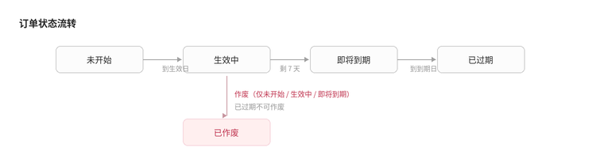
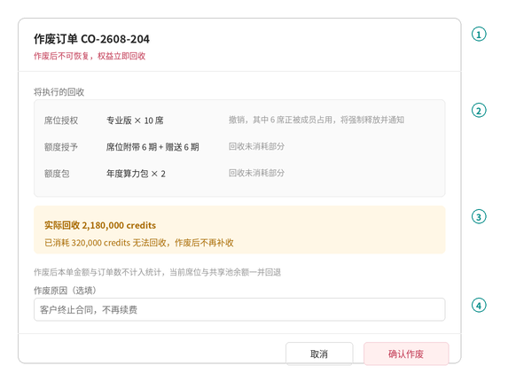

# PRD | 订单作废与有效期口径

本文是《PRD-对公支付权益下单》的增补，与《PRD-席位与额度包商品化》配套。只描述有效期的语义修正、到期提醒、订单作废三件事。未提及的部分沿用原 PRD。

---

# 1 背景与目标

## 1.1 背景

客户基本都是月付，销售每月收到款再开单。当前「有效期（月）」默认 12，一次下单就把 12 个月的额度全部发放到位，等于收 1 个月的钱发 12 个月的权益。客户中途终止时，未到期的席位与未消耗的额度没有回收入口。

## 1.2 产品目标

- ✅ 下发周期不超过已收款周期：一次下单只发本次购买的时长
- ✅ 客户终止合作时，未到期席位与未消耗额度能被真回收
- ✅ 到期前有轻量提示，销售不会因为忘记开单导致客户断服

## 1.3 本期不做

- 不做续费入口与续费单。每月收款后走「创建订单」重新开一单即可，商品化改造后需要填的只剩席位数、生效日、有效期、凭证
- 不做订单之间的续费链关联，订单彼此独立
- 不做到期日同期化。中途加席位就是开一张新单，生效日当天起算满一个月，允许同一客户存在多个到期日
- 不做欠费宽限期与自动停服

---

# 2 有效期口径修正（**改造**）

- 「有效期（月）」的语义由「合同期」改为「**本次购买时长**」
- 席位行默认值由 12 改为 **1**，额度包行默认值由 6 改为 **1**，均可手工改大
- 合同期不在本系统记录，也不参与任何计算
- 到期日算法不变，仍为生效日 + N 个自然月、月末顺延

```Plain Text
席位行金额 = 单价 × 席位数 × 有效期月数
下发期数   = 有效期月数（席位附带额度与赠送额度各发这么多期）
```

> 有效期填几，就只发几期。这条是本次改动的核心，不能因为客户签了年度合同就一次填 12。

---

# 3 到期提醒（**新增**）

做最轻的形态，不新增页面、不做推送。

## 3.1 订单状态徽章

> 📷 **截图占位** —— 订单状态流转实际运行效果



- 沿用原 PRD 第 65 条的四个状态，其中「即将到期」的判定明确为：**距到期日剩余 7 天及以内**
- 状态由到期日实时派生，不落库

| 条件 | 状态 |
|---|---|
| 当前日期 < 生效日 | 未开始 |
| 生效日 ≤ 当前日期，且距到期日 > 7 天 | 生效中 |
| 生效日 ≤ 当前日期，且距到期日 ≤ 7 天 | 即将到期 |
| 当前日期 > 到期日 | 已过期 |
| 已执行作废 | 已作废，不再随日期变化 |

## 3.2 客户头部提示条

- 该客户存在「即将到期」的订单时，在容器页头部显示一条提示：`N 张订单将在 7 天内到期，最近一张 YYYY-MM-DD 到期`
- 点击提示条落到「历史订单」tab
- 不存在即将到期的订单时不显示，不占位

---

# 4 订单作废（**新增**）

## 4.1 作废弹窗

> 📷 **截图占位** —— 作废确认弹窗实际运行效果



### ① 头部

- 标题带订单号，副标题红字提示作废后不可恢复、权益立即回收

### ② 将执行的回收

逐条列出本单产生的授权与授予，以及各自的处理方式：

| 对象 | 展示内容 | 处理 |
|---|---|---|
| 席位授权 | 商品与席位数 | 撤销；若有席位正被成员占用，写明将强制释放的人数 |
| 席位附带额度 / 赠送额度 | 期数 | 回收未消耗部分 |
| 额度包 | 商品与个数 | 回收未消耗部分 |

### ③ 回收结果预告

- 黄条给出两个数：实际可回收 credits、已消耗无法回收 credits
- 明确写出已消耗部分作废后不再补收

```Plain Text
实际可回收 = Σ 本单各额度授予单的未消耗余额
已消耗     = Σ 本单各额度授予单的已消耗量
```

### ④ 作废原因

- 选填，自由文本，写入操作留痕

### ⑤ 底部

- 「确认作废」为危险样式
- 点击后执行回收，成功后停留在历史订单并刷新

## 4.2 作废范围

| 订单状态 | 是否可作废 |
|---|---|
| 未开始 | 可 |
| 生效中 | 可 |
| 即将到期 | 可 |
| 已过期 | 否，入口置灰并提示「已过期订单无需作废」 |
| 已作废 | 否 |

> 已过期订单不允许作废，是因为权益本来就已经失效，作废只会改变历史期间的金额统计，让财务对不上账。

## 4.3 作废执行的动作

- 撤销本单产生的席位授予单
- 席位被成员占用时强制释放，并按现有机制向被释放的成员发通知
- 对本单产生的每一条额度授予单，回收其**未消耗余额**，生成反向流水；已消耗部分不动
- 订单状态置为「已作废」，记录作废人、作废时间、作废原因
- 客户头部的「当前席位」与「共享池余额」随之回退，这是真回收后的自然结果，不需要额外的账面调整

## 4.4 作废后的统计口径

- 已作废订单**不计入**：历史订单数、累计金额
- 已作废订单**仍出现在**历史订单列表中，以「已作废」徽章展示，可进入订单详情
- 订单详情保留完整的原始配置快照，并在头部展示作废信息与实际回收结果
- 额度明细中，已作废订单产生的 grant 保留展示，标注已回收

## 4.5 客户级一键终止

- 入口在容器页头部，命名为「终止服务」
- 作用范围：该客户全部处于「未开始 / 生效中 / 即将到期」的订单
- 二次确认弹窗结构与单张作废一致，回收结果为各单的合计
- 无可作废订单时入口置灰

---

# 5 边界处理

| 场景 | 处理 |
|---|---|
| 本单额度已全部消耗 | 允许作废，实际回收为 0，弹窗如实展示 |
| 本单席位全部空闲 | 直接撤销，不触发释放通知 |
| 席位被占用且成员当月已使用 | 仍强制释放，不沿用席位释放的冷却规则 |
| 作废执行中部分回收失败 | 整单回滚，订单状态不变，提示失败原因 |
| 同一客户存在多个到期日 | 属正常情况，历史订单按到期日排序即可，不做合并 |
| 客户级终止时其中一单执行失败 | 整体回滚，全部保持原状 |

---

# 6 对现有 PRD 的改动

| 原条款 | 处理 |
|---|---|
| 18 席位行有效期 | 默认值由 12 改为 1，语义改为本次购买时长 |
| 38 额度包有效期 | 默认值由 6 改为 1 |
| 63 订单记录列 | 操作列增加「作废」 |
| 65 状态取值 | 增加「已作废」；明确「即将到期」为距到期日 7 天及以内 |
| 69 订单详情纯只读 | 保持只读，但头部增加作废信息展示区 |
| 91 多次下单按叠加处理 | 补充：作废是唯一的反向操作，历史订单仍不被修改，只增加作废状态与留痕 |

《PRD-席位与额度包商品化》第 3.1 节 ③ 中的有效期默认值同步改为 1。

---

# 7 待确认

| 问题 | 建议 | 谁定 |
|---|---|---|
| 作废权限归谁 | 建议：与下单同权限，售前自己可作废。作废会真回收权益，如需收紧再单独提 | 业务 |
| 已消耗部分是否需要向客户追收 | 建议：不追收，作废弹窗里如实告知即可，追收走线下商务 | 业务 / 财务 |
| 客户级终止后是否要冻结账号 | 建议：本期不做。席位撤销后成员自然无法使用，冻结账号是另一套能力 | 产品 |
| 到期未开新单时是否需要宽限期 | 建议：不做。额度按到期日自然失效，与云厂商的停机保留不是一回事 | 业务 |

---

# 8 配套物料

- 线框图：`图片和附件/wf-订单状态流转.png`、`wf-作废弹窗.png`
